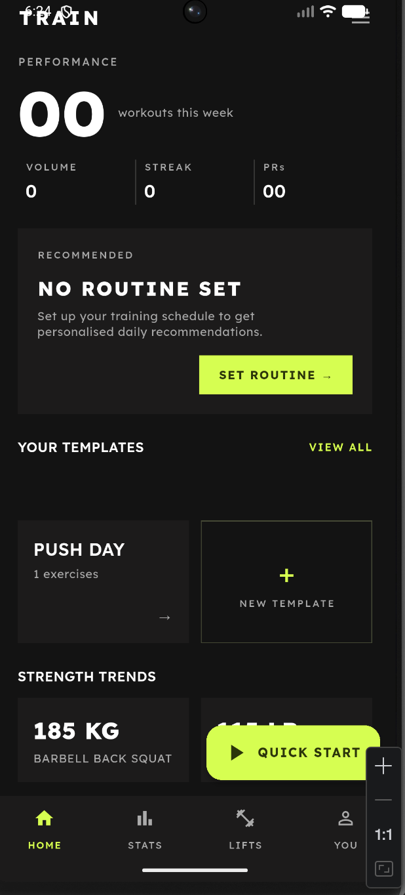
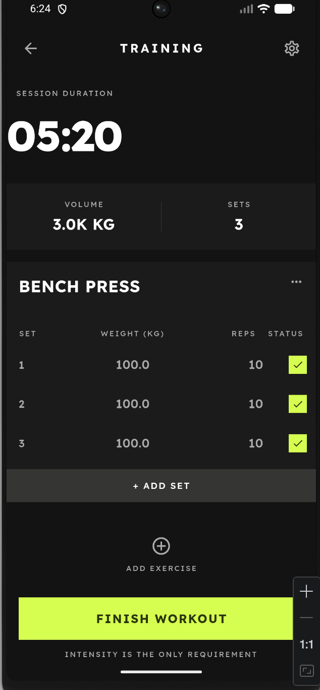
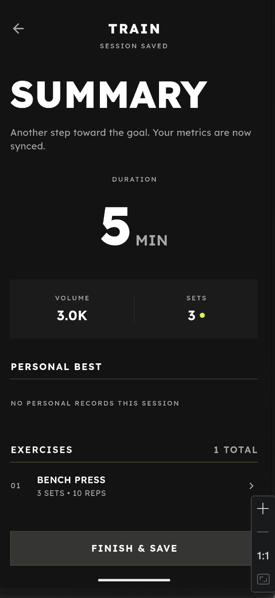
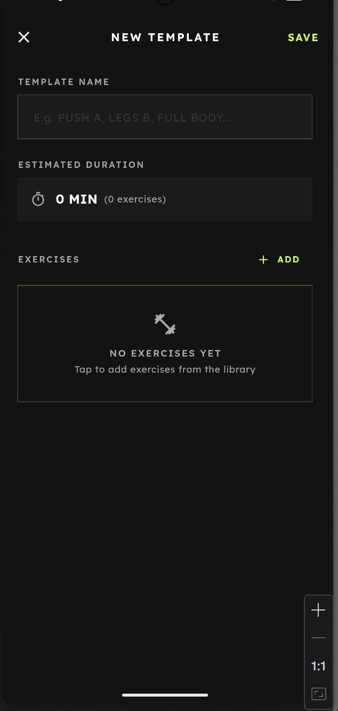
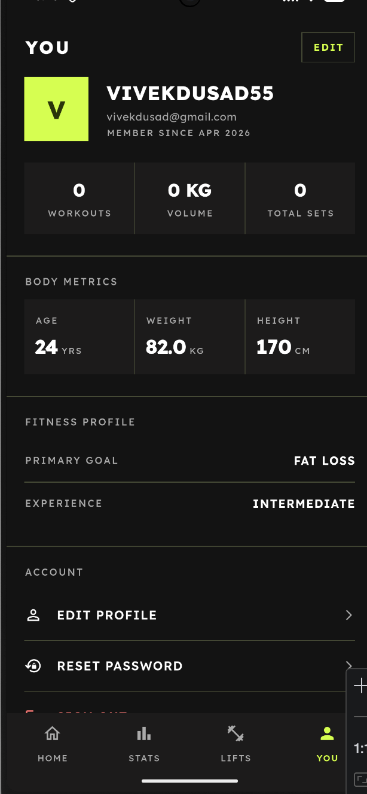
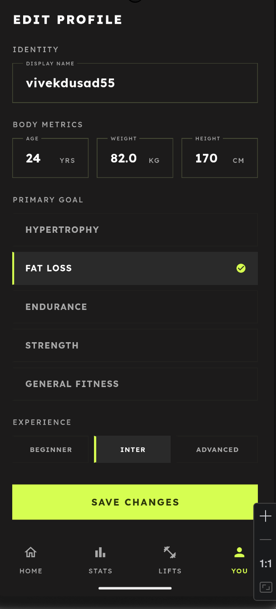

# TRAIN — AI Workout Tracker

TRAIN is an AI-powered gym workout tracker that replaces messy spreadsheets and generic fitness apps with a precision logging system built for serious lifters.

  ---
  For the User

  Stop guessing. Start tracking.

  Most people go to the gym with a vague plan and no way to measure progress. TRAIN fixes that by giving you a single place to:

  - Log every rep, set, and weight — with flexible tracking that fits how you actually train (kg/lbs, time, distance, bodyweight)
  - Build templates once, reuse forever — create your Push/Pull/Legs routine, your 5x5 squat program, or any custom workout and start it with one tap
  - See your actual progress — strength trend charts and PR detection so you know when you're getting stronger vs just showing up
  - Never lose your workout history — every session is saved to the cloud, searchable, and reviewable
  - Get a smart daily recommendation — if you follow a weekly routine, the app tells you today's workout before you step into the gym
  - Create your own exercises — if your gym has a weird machine or a movement no app supports, you can add it yourself
---

## Screenshots

<p float="left">
  
  
  
</p>
<p float="left">
  
  
  
</p>

---

## Features

### Workout Tracking
- **Quick Start** — Jump into an empty workout and add exercises on the fly
- **Template-based Workouts** — Pre-built templates (Push, Pull, Legs, etc.) with one tap to start
- **Flexible Set Logging** — Support for weight + reps, time-only, distance + time, and bodyweight reps
- **Set Types** — Normal sets, warmup sets, and drop sets with full tracking
- **Rest Timer** — Configurable rest periods between sets
- **Live Workout Timer** — Tracks elapsed workout duration in real time

### Exercise Library
- **Curated Exercise Index** — Full library organized by muscle group (Chest, Back, Legs, Shoulders, Arms, Core)
- **Search & Filter** — Find exercises instantly with full-text search and muscle-group filtering
- **Custom Exercises** — Create and save your own exercises to your personal library

### Templates & Routines
- **Workout Templates** — Build, save, and reuse workout templates with custom sets/reps/weight defaults
- **Training Routines** — Schedule a rotating weekly routine (e.g. Push/Pull/Legs) and get daily recommendations
- **Rest Days** — Automatically detects and displays rest days in your routine

### Progress & Stats
- **Weekly Dashboard** — Workouts completed, total volume, current streak, and PRs at a glance
- **Workout History** — Full log of every completed session with detailed exercise breakdown
- **Strength Trends** — Per-exercise progression charts showing your best lifts over time
- **Personal Records (PRs)** — Automatically flags and tracks your personal bests

### Design Language
- **Bold Dark Theme** — Near-black surfaces (`#131313`) with electric lime accents (`#CCFF00`)
- **Zero-radius UI** — Intentionally sharp, brutalist aesthetic throughout
- **Lexend Typography** — Clean, modern geometric sans-serif for all text
- **Native Splash Screen** — Branded launch experience on both Android and iOS

---

## Tech Stack

| Layer | Technology |
|---|---|
| Framework | Flutter 3.29+ (Dart 3.7+) |
| State Management | Riverpod 2.x with code generation (`riverpod_generator`) |
| Navigation | GoRouter 14.x with typed route definitions |
| Backend | Firebase (Firestore, Authentication) |
| Data Models | Freezed 3.x (immutable, serializable models) |
| Charts | fl_chart for strength progression graphs |
| Fonts | Google Fonts (Lexend) |

### Architecture
Clean Architecture with a **feature-first** folder structure:

```
lib/
├── app/              # Router, theme, root MaterialApp
├── core/             # Constants, errors, utilities
├── features/         # Auth, Workout, Exercises, Stats, Profile, Routine
│   └── feature/
│       ├── data/     # Repository impls, Firestore data sources
│       ├── domain/   # Repository interfaces, entities
│       └── presentation/
│           ├── screens/
│           ├── widgets/
│           └── providers/
└── shared/
    ├── models/       # Freezed data models (WorkoutTemplate, Exercise, etc.)
    ├── providers/    # App-wide providers
    └── widgets/      # Reusable cross-feature widgets
```

---

## Getting Started

### Prerequisites
- Flutter SDK 3.29+ ([install guide](https://docs.flutter.dev/get-started/install))
- Dart SDK 3.7+
- A Firebase project with **Firestore** and **Authentication** enabled

### Firebase Setup

1. Create a Firebase project at [console.firebase.google.com](https://console.firebase.google.com)
2. Add an **Android** app (package name: `com.example.aiworkouttracker`)
3. Add an **iOS** app (bundle ID: `com.example.aiworkouttrackerapp`)
4. Enable **Email/Password** and **Google** sign-in methods under Authentication
5. Create a **Firestore** database in production mode
6. Download `google-services.json` (Android) and `GoogleService-Info.plist` (iOS) and place them in the appropriate directories

### Firestore Security Rules

At minimum, restrict read/write access to authenticated users only:

```javascript
rules_version = '2';
service cloud.firestore {
  match /databases/{database}/documents {
    match /users/{userId}/{document=**} {
      allow read, write: if request.auth != null && request.auth.uid == userId;
    }
    match /exercises/{document=**} {
      allow read: if request.auth != null;
      allow write: if false; // Built-in exercises are read-only
    }
  }
}
```

### Installation

```bash
# Clone the repository
git clone https://github.com/your-username/ai_workout_tracker_app.git
cd ai_workout_tracker_app

# Install dependencies
flutter pub get

# Generate Freezed, Riverpod, and JSON serializable code
dart run build_runner build --delete-conflicting-outputs

# Generate native splash screens (first time only)
dart run setup_splash.dart
dart run flutter_native_splash:create

# Seed the exercise library (optional — run once)
dart run scripts/seed_exercises.dart

# Run the app
flutter run
```

### Building for Release

```bash
# Android
flutter build apk --release

# iOS
flutter build ipa --release
```

---

## Project Structure

```
ai_workout_tracker_app/
├── design/app_designs/          # UI design reference screenshots
├── lib/
│   ├── app/
│   │   ├── router/              # GoRouter configuration + generated routes
│   │   ├── theme/               # AppTheme (dark), AppColors, text styles
│   │   └── app.dart             # MaterialApp.router root
│   ├── core/
│   │   ├── constants/           # Firestore collection name constants
│   │   └── errors/              # Failure classes for error handling
│   ├── features/
│   │   ├── auth/               # Firebase Auth (login, register, Google Sign-In)
│   │   ├── workout/            # Active workout, templates, home screen
│   │   ├── exercises/          # Exercise library + custom exercise creation
│   │   ├── stats/              # Weekly stats, workout history, PRs
│   │   ├── routine/            # Weekly training schedule management
│   │   └── profile/           # User profile and settings
│   └── shared/
│       ├── models/             # Freezed models (Exercise, WorkoutTemplate, etc.)
│       └── widgets/            # Reusable widgets (ExercisePicker)
├── scripts/
│   └── seed_exercises.dart     # Seed Firestore with initial exercise library
└── flutter_native_splash.yaml  # Native splash screen configuration
```

---

## Firestore Data Model

```
users/{userId}/
  ├── workoutTemplates/{templateId}   # User's saved templates
  ├── workoutSessions/{sessionId}      # Completed workout logs
  ├── customExercises/{exerciseId}     # User-created exercises
  └── routine/                         # User's weekly training schedule

exercises/{exerciseId}                 # Global (read-only) exercise library
```

---

## Contributing

Contributions are welcome. Please feel free to open an issue or submit a PR.

1. Fork the repository
2. Create a feature branch (`git checkout -b feature/my-feature`)
3. Run `flutter analyze` and `flutter test` before committing
4. Ensure all new code follows the feature-first clean architecture pattern

---

## License

MIT License — see [LICENSE](LICENSE) for details.
